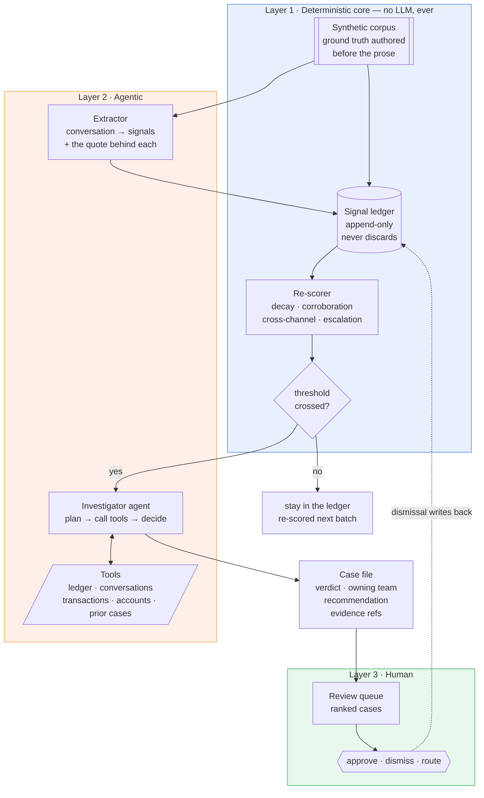
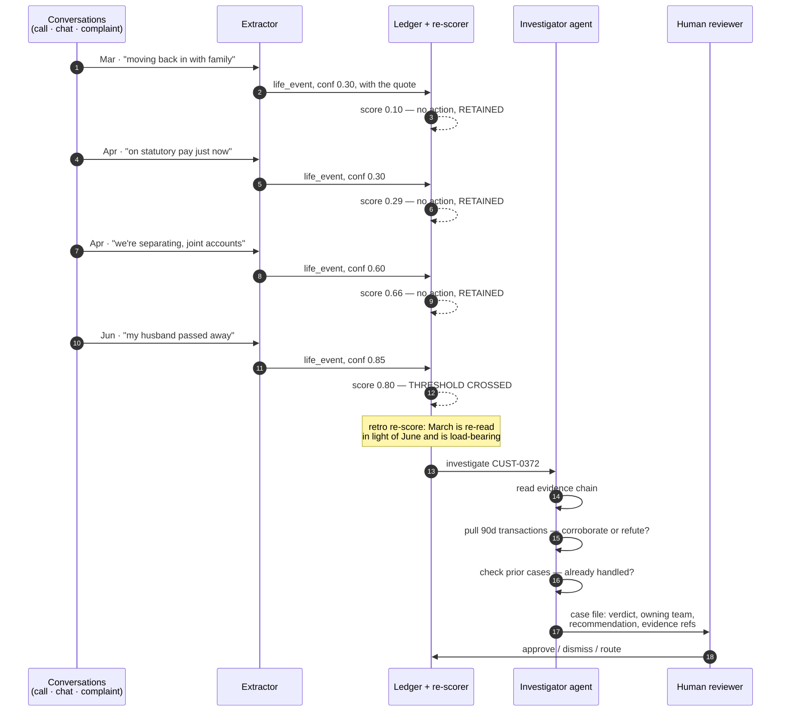
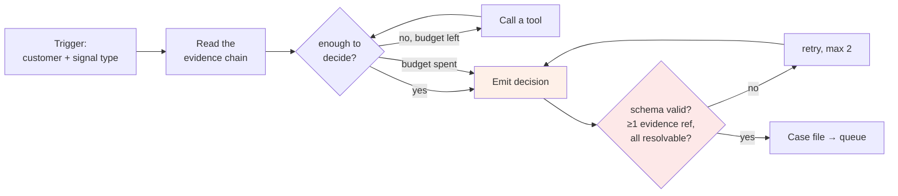
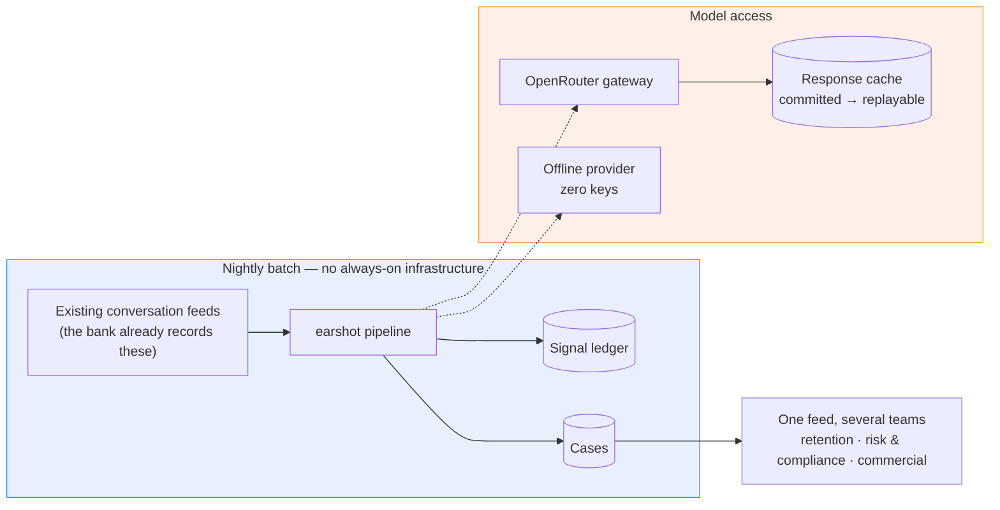

# Architecture — Ear on Every Call

One sentence: **banks read every conversation and remember no customer.** We keep a standing
per-customer signal ledger, and when it crosses a threshold an agent investigates and hands a
decision-ready case to a human.

The full plan of record is [build-plan.md](build-plan.md). This page is the shape of the system.

---

## The one design rule

> **Code counts and remembers. The model reads and judges.**

Arithmetic, accumulation, decay and thresholds are plain Python — deterministic, unit-tested,
reproducible bit-for-bit. Reading natural language and weighing ambiguous evidence is the model's job.
Every boundary below follows from that split, and a test enforces it.

---

## Three layers

**Why the split matters.** Incumbent customer memory reconciles to *current truth*: new observations
supersede old ones. That is right for personalization and wrong for risk, because three faint signals
must **sum** rather than overwrite. Layer 2 exists because something has to decide whether a threshold
crossing is real, and that is judgement rather than arithmetic.

---

## Data flow — one customer, four months

The agent never contacts the customer. There is no outbound surface anywhere in the system — HITL is
enforced by absence, not by policy.

---

## The agent loop

Bounded by design: **max 6 steps, max 2 retries, and a per-investigation cost cap** checked before
each call rather than after it. The cap holds cumulative spend for any realistic cost curve; a single
call is bounded separately by `max_tokens` and a cap on how much tool output can re-enter the prompt.
Budget exhaustion returns `insufficient_evidence` rather than raising.

**Evidence is mandatory.** A decision must cite at least one `EvidenceRef` — conversation id, turn
index and quote — where the quote is a run of **at least four consecutive words** of that turn,
matched on word boundaries. A decision citing an unresolvable reference fails validation and is
retried. The floor is the point: a plain substring test accepts the empty string and a single
letter, both of which appear in every turn, so it certifies citations that are not evidence. Case and
whitespace are still forgiven. This bounds *splicing*, not meaning — a quote can still drop a leading
negation, which is why the case file prints the citation for a human to read.

---

## Runtime shape

Batch, not real-time — a deliberate choice, and the one that makes the economics work. The cost that
matters is **per conversation**, not latency on a live call. Updating a ledger costs no model call at
all, where re-reading a customer's whole history through a model every night costs one per customer
per night. *(The ledger re-scores a customer from scratch today rather than incrementally — the saving
is the absent model call, not an O(1) update. An incremental path is not built.)*

**Integration surface is thin on purpose:** read the conversation feeds a bank already produces, write
cases into a queue each team already works. It adds a memory on top of the tools banks already run
rather than replacing them.

---

## Repository map

| Path | What lives there |
|---|---|
| `src/earshot/corpus.py`, `memory.py` | Layer 1. Dataset generation, the ledger, the re-score maths. No LLM import |
| `src/earshot/core/` | Synthetic account and transaction state behind the agent's tools |
| `src/earshot/agent/` | Layer 2. Investigator loop, tools, decision schemas, prompt loading |
| `src/earshot/llm/` | Provider abstraction: OpenRouter, offline, response cache, cost + latency capture |
| `src/earshot/evals.py`, `sweep.py` | Metrics, and the multi-seed harness that produces anything quotable |
| `prompts/investigator/v1/` | Prompts as versioned files, so a prompt change is a reviewable diff |
| `artifacts/cache/` | Committed model responses — `earshot investigate --provider openrouter` replays them with no keys and no network |
| `artifacts/runs/pinned/` | One committed run + manifest (seed, git SHA, config hash) |
| `docs/` | This page, the build plan, gate briefs, deliverables |

---

## What is measured

| Question | Metric |
|---|---|
| Does the extractor find what was planted? | Conversation-level recall vs seeded signals — matched on (conversation, signal type), not on character spans; **published miss rate** |
| Does memory beat forgetting? | **Nine arms** at equal alert budget, broken out per stratum, paired seed by seed with an exact sign test |
| Does each scoring mechanism earn its place? | Per-mechanism ablation |
| Does any of it beat chance? | `random-rank` — a seeded RNG that ignores every signal — is a shipped arm. **Measured 2026-08-31: full-ledger vs chance on diffuse arcs is 18–8–4, `p=0.076`. It does not.** |
| Can a past conversation be worth more? | Each entry's marginal contribution at write against its contribution today. **Measured 2026-08-31: 239 / 485 rise under the full ledger, 0 / 485 under an unweighted count** |
| **Which desks exist at all?** | Both readers' signals through the SAME ledger at the SAME threshold, denominators = planted counts. **Measured 2026-08-31: crossings go 0 / 20 → 20 / 20 complaints, 0 / 20 → 19 / 20 vulnerability, 1 / 20 → 16 / 20 retention, 9 / 20 → 10 / 20 collections; coverage 59 / 282 → 177 / 282. The model column is an UPPER BOUND — the threshold is a top-K cut over the OFFLINE reader's ranking, held fixed across arms** |
| Is the agent right? | Verdict and routing accuracy vs the seeded trajectory. **Measured 2026-08-31: 29 / 50 verdicts (16 / 25 caught, 13 / 25 dismissed, 0 abstained), 27 / 48 routing (2 wrong, 19 declined)** |
| Is the agent honest? | Share of decisions whose evidence resolves on the FIRST attempt (not after retries). **50 / 50, no repairs — measured 2026-08-31** |
| Can a bank afford it? | **Measured 2026-08-31: $1.58 per 1,000 conversations read, $0.0306 per investigation; reader p50 1,333 ms / p95 2,162 ms** |

Comparison numbers come from `earshot sweep` and are written to a run manifest with their seed list.

**Where the numbers stand — 30 seeds, 5,796 outcome customers, corpus rebuilt 2026-08-31.** On
diffuse arcs the ledger beats both capped-memory arms (`stateless-top2`, `window3-top2`) `30–0–0` at `p<0.001` under both tie-break
rules, and the two arms that never discard a weak signal rank first and second of nine. **It does not
beat chance there: `18–8–4`, `p=0.076`**, nor on any other stratum. Whole-portfolio it is 8th of 9
arms — recall 0.115 (665 / 5796) against random ranking's 0.113 (657 / 5796) — and on concentrated
arcs it loses `0–30–0` to three separate arms.

Two results are published as losses rather than smoothed away. The headline pre-registered on
2026-08-09 (`full-ledger` vs `stateless-max` on diffuse) **died** on the rebuilt corpus, 29–0–1 to
`15–13–2`, `p=0.851`; it is re-registered against `window3-top2` and bound to a chance gate the entry
currently fails (D-031). And `dumb-ledger` — every mechanism in `memory.py` switched off — beats the
full ledger on diffuse arcs, `18–7–5`, `p=0.043`, which becomes 13–11–6 `p=0.839` once ties are
randomised, because 70.8% of that arm's queue is decided alphabetically against the full ledger's 0.0%.

Records have now reversed twice across two corpus rebuilds, so they describe the corpus at least as
much as the mechanism. The binding constraint is the reader, not the ranking: the offline lexicon
finds 617 of 2,700 planted signals and leaves two of four review desks receiving no case at all, which
crowds every arm between 0.113 and 0.145. **Every arm figure on this page is on that weak reader** —
the model reader takes those two dead desks to 20 / 20 and 19 / 20 — so the arm ordering is internally
valid and the absolute level is a floor, not the system's ceiling.

**AT-58's routing figure is measured on a queue that gap had already flattened.** Its confusion
matrix's `complaints` row is entirely empty, because no complaint customer ever crossed under the
offline reader; 43 of the 48 scorable cases are one desk. That is the same coverage failure, arriving
through the routing door.

So the arms answer *which trigger feeds the investigator best*, not *what the product is*. What
never-discard buys over a cheap bounded window is now measured in all three directions: **won** on
diffuse (30–0–0), **lost** on concentrated (1–28–1), unproven whole-portfolio (9–17–4, `p=0.169`).
Full table and method in the README, which is the source of record.
