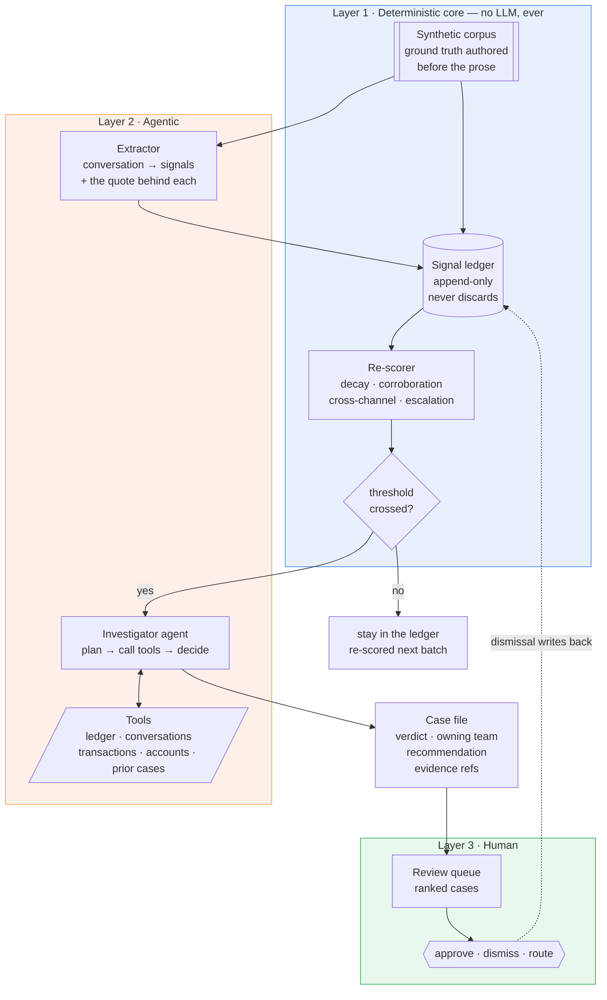
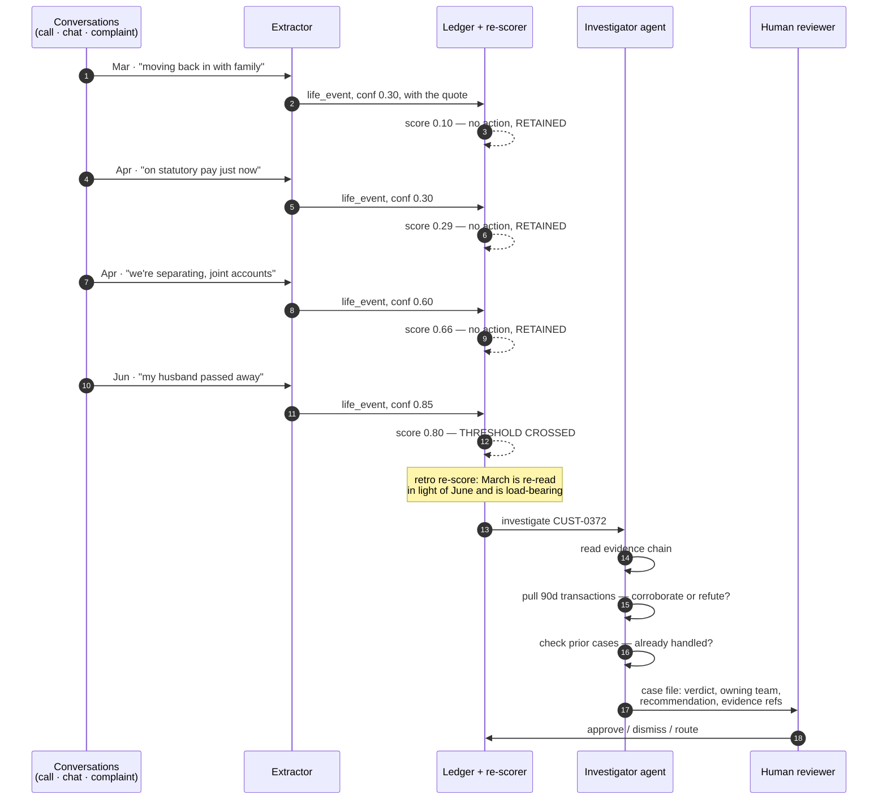
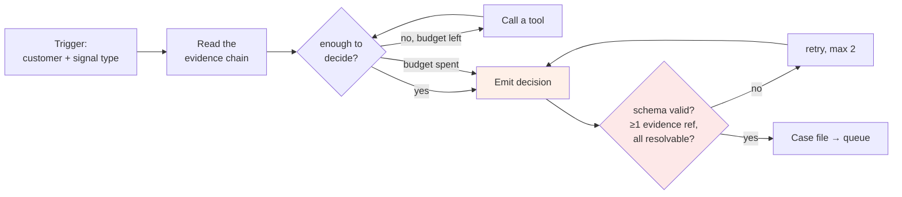
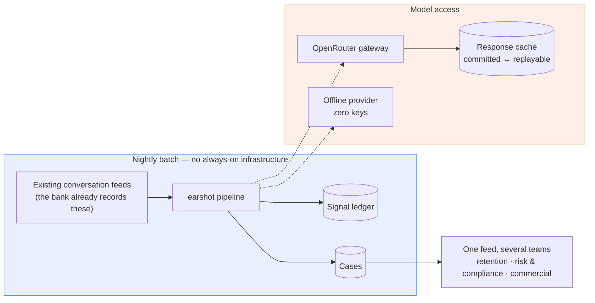

# Architecture — Ear on Every Call

One sentence: **banks read every conversation and remember no customer.** We keep a standing
per-customer signal ledger, and when it crosses a threshold an agent investigates and hands a
decision-ready case to a human.

The full plan of record is [build-plan.md](build-plan.md). This page is the shape of the system.

---

## The one design rule

> **Code counts and remembers. The model reads and judges.**

Arithmetic, accumulation, decay and thresholds are plain Python — deterministic, unit-tested,
reproducible bit-for-bit. Reading natural language and weighing ambiguous evidence is the model's job.
Every boundary below follows from that split, and a test enforces it.

---

## Three layers

**Why the split matters.** Incumbent customer memory reconciles to *current truth*: new observations
supersede old ones. That is right for personalization and wrong for risk, because three faint signals
must **sum** rather than overwrite. Layer 2 exists because something has to decide whether a threshold
crossing is real, and that is judgement rather than arithmetic.

---

## Data flow — one customer, four months

The agent never contacts the customer. There is no outbound surface anywhere in the system — HITL is
enforced by absence, not by policy.

---

## The agent loop

Bounded by design: **max 6 steps, max 2 retries, and a per-investigation cost cap** checked before
each call rather than after it. The cap holds cumulative spend for any realistic cost curve; a single
call is bounded separately by `max_tokens` and a cap on how much tool output can re-enter the prompt.
Budget exhaustion returns `insufficient_evidence` rather than raising.

**Evidence is mandatory.** A decision must cite at least one `EvidenceRef` — conversation id, turn
index and verbatim quote — that resolves against the corpus. A decision citing an unresolvable
reference fails validation and is retried.

---

## Runtime shape

Batch, not real-time — a deliberate choice, and the one that makes the economics work. The cost that
matters is **per conversation**, not latency on a live call. Updating a ledger costs no model call at
all, where re-reading a customer's whole history through a model every night costs one per customer
per night. *(The ledger re-scores a customer from scratch today rather than incrementally — the saving
is the absent model call, not an O(1) update. An incremental path is not built.)*

**Integration surface is thin on purpose:** read the conversation feeds a bank already produces, write
cases into a queue each team already works. It adds a memory on top of the tools banks already run
rather than replacing them.

---

## Repository map

| Path | What lives there |
|---|---|
| `src/earshot/corpus.py`, `memory.py` | Layer 1. Dataset generation, the ledger, the re-score maths. No LLM import |
| `src/earshot/core/` | Synthetic account and transaction state behind the agent's tools |
| `src/earshot/agent/` | Layer 2. Investigator loop, tools, decision schemas, prompt loading |
| `src/earshot/llm/` | Provider abstraction: OpenRouter, offline, response cache, cost + latency capture |
| `src/earshot/evals.py`, `sweep.py` | Metrics, and the multi-seed harness that produces anything quotable |
| `prompts/investigator/v1/` | Prompts as versioned files, so a prompt change is a reviewable diff |
| `artifacts/cache/` | Committed model responses — `earshot investigate --provider openrouter` replays them with no keys and no network |
| `artifacts/runs/pinned/` | One committed run + manifest (seed, git SHA, config hash) |
| `docs/` | This page, the build plan, gate briefs, deliverables |

---

## What is measured

| Question | Metric |
|---|---|
| Does the extractor find what was planted? | Conversation-level recall vs seeded signals — matched on (conversation, signal type), not on character spans; **published miss rate** |
| Does memory beat forgetting? | Five arms at **equal alert budget**, broken out per stratum |
| Does each scoring mechanism earn its place? | Per-mechanism ablation |
| Is the agent right? | Verdict and routing accuracy vs the seeded trajectory — **not yet computed** |
| Is the agent honest? | Share of decisions whose evidence resolves on the FIRST attempt (not after retries) — **not yet computed** |
| Can a bank afford it? | Tokens, steps and cost per investigation are captured; cost per 1,000 conversations and p50/p95 are **not yet computed** |

Comparison numbers come from `earshot sweep` and are written to a run manifest with their seed list.

**Where the numbers stand.** Across ten datasets, the ledger catches 134 of 780 thin-evidence
customers against 96 of 780 for score-each-call-and-forget (8 wins, 2 ties, no losses, `p=0.008`), and
*loses* on concentrated arcs by a comparable margin (119 of 629 against 180 of 629, `p=0.039`). The
result is a trade: the more conversations an arm may combine, the better it does on thin evidence and
the worse on a single loud call. Overall no arm is distinguishable from any other; a plain unweighted
count matches the full ledger, and so does summing the two loudest calls. So the arms answer *which
trigger feeds the investigator best*, not *what the product is*. Full table and method in the README.
