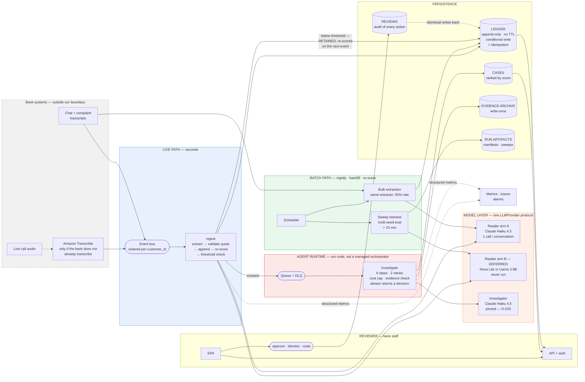

# Infrastructure architecture and build scope

**Authored 2026-08-11.** Technical design document for the AWS deployment of *Ear on Every Call*.

**§1 is the architecture** and is written to be attacked: every load-bearing claim is numbered `A1…An`,
every unresolved question is `Q1…Qn`, and §1.9 lists the assumptions a reviewer should try to break
first. **§2 is the scope of build** — what exists, what changes, what we refuse to build. **§3 is
service selection**, one subsection per area, with a named rejected alternative for every choice.
**§4 is failure modes.** Prices are deliberately absent from the body: **Appendix A** is the
provisioning table (one row per SKU) and **Appendix B** is the cost model.

Read [architecture.md](architecture.md) first for the product shape. This document does not restate it.

---

# §1 · Architecture

## 1.1 The invariant this deployment must preserve

> **Code counts and remembers. The model reads and judges.**

Accumulation, decay, corroboration and thresholds are deterministic Python in
[memory.py](../../src/earshot/memory.py). Reading language and weighing ambiguous evidence is the
model's job. Every infrastructure choice below is downstream of that split, and three product rules
constrain it absolutely:

| Rule | What it forbids in infrastructure terms |
|---|---|
| **Never discard a sub-threshold signal** | No TTL, no compaction, no eviction, no "archive after N days" on the ledger. Deletion must be impossible, not merely unused. |
| **Retro re-scoring must be observable** | Every entry must persist what it scored *then* and what it scores *now*. A store that keeps only current state cannot serve the product's central demo beat. |
| **No outbound contact surface exists** | HITL is enforced by absence. Any messaging service we add must be provably unable to reach a customer. |

**A1.** These are architectural constraints, not policy. If a component makes any of them merely
*conventional* rather than *structural*, that component is wrong.

## 1.2 Scope boundary — where the system starts

**Transcribing live audio is out of scope.** The input contract is a transcript event, not an audio
stream. Contact-centre platforms already produce these.

**A2.** The boundary is commercial as well as convenient. If a bank does not already transcribe, ASR
costs roughly **100× the entire rest of this system** (Appendix B.4, recomputed 2026-08-28 from B.3's
own totals: ~\$72,000/mo of transcription against ~\$721/mo of everything else at 500,000
conversations, on the reader arm that has actually run). A product requiring the bank to start
transcribing is a different, far more expensive product. Amazon Transcribe is drawn in §1.3 as the
attachment point; we neither build it nor pay for it.

*This line previously said 55–80× and B.4 said 55–140×. Neither followed from the tables in either
version of them; both are now derived from B.3 and stated identically in both places. B.4 also carries
a ~234× projection on an unmeasured second reader arm; it is deliberately not the headline.*

**Input contract** — identical to `schema.Conversation`
([schema.py:56-69](../../src/earshot/schema.py#L56-L69)), so no translation layer exists on our side:

```json
{ "conversation_id": "...", "customer_id": "...", "channel": "call|chat|complaint",
  "day": 0, "turns": [ {"index": 0, "speaker": "customer", "text": "..."} ] }
```

## 1.3 System diagram — live path and batch path



**A3.** Both paths converge on **one ledger and one re-scorer**. Streaming and batch are two schedules
for one pipeline, not two systems. A reviewer should check that no logic is duplicated across them — if
the batch path re-implements scoring, the architecture has already failed.

## 1.4 Component responsibilities

| Component | Owns | Explicitly does not own |
|---|---|---|
| **Event bus** | Ordering per `customer_id`; durability; at-least-once delivery | Deduplication (§1.6) |
| **`ingest`** | One conversation → signals → ledger append → re-score → threshold decision | Judging whether a crossing is real |
| **Ledger store** | Append-only durability; idempotency; retro fields | Any scoring arithmetic |
| **Re-scorer** (`memory.py`, unchanged) | Decay, corroboration, cross-channel, escalation, leave-one-out contribution | Any model call, ever |
| **Queue** | Backpressure between cheap ingest and expensive investigation | Retry semantics inside one investigation |
| **`investigate`** | The bounded loop, tool execution, evidence validation, the decision | Deciding *which* customers to investigate |
| **Case store** | Ranked queue; evidence chain; retro timeline | Business rules about who reviews what |
| **Reviewer API/UI** | Presenting evidence; recording a human decision | Making any decision automatically |

## 1.5 The model layer — two providers, one protocol

**A4.** The system makes exactly two kinds of model call, and they have opposite economics.

| Call | Volume | Shape | Model |
|---|---|---|---|
| **Read** — one conversation → signals | 1 per conversation. **This is the entire cost curve.** | Short input, short JSON output, heavily schema-constrained, stateless | **Arm A measured, arm B deferred and never run:** Claude Haiku 4.5 (arm A); arm B is now a Bedrock model, Nova Lite or Llama 3 8B (below) |
| **Judge** — one investigation | 1 per threshold crossing, ~0.5% of conversations | Multi-turn tool loop, 4–6 model calls measured, long context | **Claude Haiku 4.5**, pinned (D-025) |

### Why a second reader arm — and why it is deferred rather than done

1. **It is a written deliverable.** The submitted brief commits to a second model through the same eval
   harness. Putting both arms on the *reader* rather than the investigator means the comparison runs on
   the path where volume — and therefore cost and latency — actually matters.
2. **The reader was the entry's weakest point, and arm A has now answered it.** The offline lexicon
   scores 0.0357 strict recall (4 / 112) on real CFPB narratives. **Arm A, Claude Haiku 4.5 on Bedrock,
   scores 0.8214 (92 / 112)** on the identical 150-document gold set — measured 2026-08-28,
   [benchmarks/cfpb/RUNLOG.md](../../benchmarks/cfpb/RUNLOG.md), replayable keyless from
   `artifacts/cache/extractor.jsonl`. It buys that with 8× the false-positive rate: 0.1598 (78 / 488)
   against the lexicon's 0.0205.
3. **`Extractor` is a protocol with two implementations already**
   ([extract.py](../../src/earshot/extract.py), [extract_model.py](../../src/earshot/extract_model.py)).
   A third arm is a constructor argument, not a redesign.

**Arm B has never been run, and it is no longer GPT-4o-mini.** D-022 moved every model call to Bedrock
and dropped the OpenAI key, so the second arm is now **Amazon Nova Lite or Meta Llama 3 8B** — both
on-demand and invocable today, both already priced in `PRICE_PER_1M_TOKENS`
([llm/bedrock.py:96-101](../../src/earshot/llm/bedrock.py#L96-L101)), and both reachable through the
Converse translation that already exists for arm A. **What it costs to close: one run, \$0.01 of model
spend** — 150 CFPB documents through `--extractor model` with the arm B model id, then commit the
response cache (B.1: 150 × \$0.000096 on Nova Lite; **\$0.28** if both arms are re-run together). There
is no integration work left, which is exactly why leaving it unmeasured is a scheduling choice and
should be stated as one.

*§3.4 and Appendix A rows 1 and 4 still describe arm B as GPT-4o-mini over a direct OpenAI key. They
predate D-022 and are stale; they are flagged here rather than silently patched.*

### Why Haiku 4.5 is pinned on the investigator

**D-025 (2026-08-25) dropped Sonnet 4.5 entirely and put one model, Haiku 4.5, on both the reader and
the investigator.** The pin is to the model id in
[llm/bedrock.py:72](../../src/earshot/llm/bedrock.py#L72) —
`us.anthropic.claude-haiku-4-5-20251001-v1:0` — not to a family name, so a snapshot change is a
one-line diff a reviewer can see.

Two reasons, and only one of them is cost:

1. **Sonnet is not invocable on this account.** It needs a one-time Anthropic use-case/EUA form and
   returns `ResourceNotFoundException` until that is filed; Haiku needs none. Dropping Sonnet
   *unblocked* the investigator rather than economising on it.
2. **It is roughly three times cheaper per investigation, measured.** \$0.0295 mean against Sonnet's
   \$0.093 (Appendix B.1), over 50 keyed cases on 2026-08-29: p95 \$0.0357, max \$0.0368, 4–5 model
   calls per case, all 50 stopped `decided`.
   **`COST_CAP_PER_CASE_USD` was re-derived from that run and is now \$0.10**
   ([cli.py](../../src/earshot/cli.py)). At \$0.25 it sat at 6.8× the worst of those 50 cases and
   never bound once — a ceiling that cannot be reached is not a ceiling, and D-025 said so at the
   time. \$0.10 is ~2.6× the worst observed case and ~2.5× a full `MAX_STEPS` loop at the measured
   per-call rate, so an honest case still cannot trip it while a runaway stops at roughly three
   cases' worth of spend instead of eight. A test ties the cap to `MAX_STEPS`, so raising the step
   budget without revisiting the cap fails loudly.

**The cost argument is better supported than it was, and still not settled.** Cheap is only a win if
the verdicts are right, and on the same 50-case run Haiku's verdict accuracy is **29 / 50** — 16 / 25
real cases caught, **13 / 25 false alarms dismissed**, 0 abstentions (2026-08-31,
`tools/verdict_accuracy.py`). That replaces **22 / 50 with 4 / 25 dismissals**, where the honest read
was "a model that escalates almost everything is cheap per call and expensive per reviewer-hour".
**The agent did not change; the corpus stopped leaking the answer through surface form** (decoys
paraphrase rather than repeat verbatim, quotes are no longer ASR-mangled, arcs cohere). So D-025 may
now be presented as cheap *and* discriminating on a balanced sample — but not as a cost *win*, because
the comparison that would settle it is the same 50 cases through a second model, which has never been
run.

**Cache note.** `artifacts/cache/investigator-demo.jsonl` is keyed on the model, so the Sonnet-era
entries in it replay only a Sonnet run. The Haiku work has its own cache,
`artifacts/cache/investigator-bedrock.jsonl` — **one response cache per provider**, never merged.

**Rejected: upgrading to Opus, or filing the form for Sonnet.** Both are better models. Neither is
worth losing comparability with every published number before a gate, and the open question is whether
a *better* model discriminates where Haiku does not — which is a measurement, not a purchase. Revisit
after 09-07.

### The provider abstraction absorbs all of this

[llm/base.py:101-108](../../src/earshot/llm/base.py#L101-L108) defines `LLMProvider` as a two-method
protocol; `Completion` already carries tokens, latency and cost. Adding a provider is **a new file next
to `openrouter.py`**, and the caching wrapper, the cost accounting and the investigator loop cannot tell
the difference.

**A5.** The wire formats differ in effort by an order of magnitude, and this drives the routing decision
in §3.4:

- **OpenAI** — `openrouter.py` *is* OpenAI-shaped chat/completions with `tools`
  ([openrouter.py:66-112](../../src/earshot/llm/openrouter.py#L66-L112)). An OpenAI provider is a base
  URL and an auth header. **Near-zero work.**
- **Bedrock (Converse)** — different message shape (`toolUse`/`toolResult` blocks). Needs a real
  translation layer in both directions. **Contained, but not free.**

## 1.6 Data model and the two structural guarantees

### Ledger

```
PK = CUST#<customer_id>
SK = SIG#<day>#<conversation_id>#<signal_type>
```

Single-partition read-all-then-append. Every write is conditional on `attribute_not_exists(SK)`.

**A6 — never-discard is enforced by the store, not by discipline.** No TTL attribute is configured on
the table. Deletion requires an explicit `DeleteItem` that no IAM role in the system is granted. The
guarantee is a permission boundary, not a code convention.

**A7 — idempotency is a correctness requirement introduced by streaming, and it is the only genuinely
new one.** At-least-once delivery means a conversation can arrive twice. `_raw()` sums per-signal at
[memory.py:100-102](../../src/earshot/memory.py#L100-L102), so a duplicate append inflates the score —
and never-discard means nothing downstream ever removes it. The conditional write makes the second
delivery a no-op; its failure count is the duplicate-delivery metric.

**A8 — the re-score maths does not change at all.** `score()` recomputes a customer from scratch, which
is O(n²) in that customer's entries. Irrelevant at 5–20 entries, and it *stays* irrelevant online
because we only ever score one customer per event. The architecture doc's caveat about there being no
incremental O(1) update does not bite here.

### Cases

```
PK  = CASE#<case_id>
GSI: PK = QUEUE#<status>, SK = <zero-padded score>
```

Stores what `cli.py` currently discards. [cli.py:519-531](../../src/earshot/cli.py#L519-L531) writes
`decision` and `trace` but drops `ctx.score`, `ctx.signal_type`, `ctx.threshold`, and the retro fields
computed at [memory.py:139-145](../../src/earshot/memory.py#L139-L145). **All three reviewer-UI beats —
ranked list, evidence chain, retro re-score — are unrenderable from disk today.**

**Rejected: regenerating the corpus from `manifest.seed` to recover transcripts.** Named as dangerous in
state-of-play, because it puts `stratum`, `outcome` and `latent_risk` on one object behind a
client-facing screen.

### Reviews

Who approved/dismissed/routed, when, and why. The architecture diagram has a dismissal-writes-back
arrow; **the code has nothing behind it.** A write-back that mutates the case in place destroys the
audit trail on the one table a regulator would ask for.

## 1.7 The agent runtime — what we refuse to delegate

**A9. This is the most consequential decision in the document.**

The bounded loop already exists and is already tested:
[investigator.py:257-433](../../src/earshot/agent/investigator.py#L257-L433) enforces max 6 steps, max 2
retries, a **pre-flight** cost cap checked before each call, a tool-output character cap, max 8 tool
calls per step, and a contract that it always returns a decision and never raises. Evidence validation
at [tools.py:484-537](../../src/earshot/agent/tools.py#L484-L537) requires a run of at least four
consecutive words matched on word boundaries, applied inside the loop, and measurable as a first-attempt
failure rate.

**We host this. We do not hand it to a managed orchestrator.**

- **Rejected: AWS Step Functions.** It would re-express, as state-machine JSON, control flow that is
  ~180 lines of tested Python — and move the cost cap and retry policy out of the repository a judge
  reads.
- **Rejected: Bedrock Agents / AgentCore.** Same objection, worse. The bounded loop, the pre-flight cost
  cap and the four-word verbatim check *are* the differentiated engineering in this entry. Delegating
  them deletes the thing being judged, and takes `InvestigationTrace` — per-step cost, tokens, latency,
  `stopped_because` — with it.

**A10 — the cost cap's honest limit is documented and must stay documented.** It bounds *cumulative*
spend against the priciest call so far times a growth factor; it cannot bound a single anomalous call.
That is stated at [investigator.py:44-53](../../src/earshot/agent/investigator.py#L44-L53) and covered by
a test. Any deployment summary that implies a hard per-call ceiling is wrong.

## 1.8 What changes versus the current batch design

| # | Change | Size |
|---|---|---|
| 1 | `extract_all()` (a loop over a corpus) becomes one handler invocation per event. **`extract()` itself is untouched** — it was already stateless per conversation ([extract_model.py:184-229](../../src/earshot/extract_model.py#L184-L229)). | Small |
| 2 | `SignalLedger` gains a load/persist boundary around an unchanged `_raw()` and `score()`. | Medium |
| 3 | Idempotent conditional writes (A7). | Small, mandatory |
| 4 | A second provider implementation, plus cost derivation where the provider does not return a charged amount (§3.4). | Medium |
| 5 | Case persistence, so the reviewer UI has something to read (§1.6). | Small, blocking everything client-facing |
| 6 | Batch does not disappear — it is the same code on a schedule for backfills, re-scoring after a config change, and the sweep harness. | None |

**A11.** Streaming changes *when* the work happens, not *what* it costs. The same one model call per
conversation is made either way. [architecture.md:168](architecture.md#L168) defends batch on economics;
that argument survives intact.

## 1.9 Assumptions a reviewer should attack first

| # | Assumption | Why it might be wrong |
|---|---|---|
| **A2** | Banks already transcribe, so ASR is out of scope | If a target bank does not, the cost story inverts and the wedge narrows |
| **A3** | One ledger and one re-scorer serve both paths | Batch backfill may want bulk semantics that quietly fork the scoring code |
| **A4** | The reader is the entire cost curve | Only true while investigation rate stays near 0.5%; a noisier threshold changes the ratio |
| **A6** | Absence of a TTL plus absence of a delete permission is a sufficient never-discard guarantee | A table-level restore, a CDK drift, or an admin role could still delete |
| **A7** | Conditional write on `(conversation_id, signal_type)` is the right idempotency key | If one conversation can legitimately yield two signals of the same type at different turns, this silently drops the second |
| **A8** | Per-customer O(n²) re-scoring stays cheap online | Breaks for a pathological customer with hundreds of entries; unbounded by construction |
| **A9** | Hosting the loop ourselves beats a managed orchestrator | Operationally we own retries, poison messages, and concurrency that Step Functions would give us |
| **A11** | Streaming does not change unit cost | Ignores per-invocation overhead and any loss of batch-rate discounting |

### Open questions

- **Q1.** What is the real investigation rate? The code's 10% is an equal-alert-budget *evaluation*
  device ([cli.py:44](../../src/earshot/cli.py#L44)), not a production operating point. Every capacity
  and cost figure downstream depends on the real number.
- **Q2.** Does a conversation ever legitimately produce two signals of the same type? Both readers
  currently collapse to one per `(conversation, type)`. If the ledger key encodes that assumption
  permanently, changing the grain later is a migration.
- **Q3.** Does the dismissal write-back reduce the score, suppress the customer, or only annotate?
  "Writes back" is drawn but not specified — and a write-back that *reduces* a score is in tension with
  never-discard.
- **Q4.** Ordering guarantee under retry: if event N+1 is processed before a retried event N, is
  `score_at_write` still honest? Per-customer ordering protects the happy path, not the retry path.
- **Q5.** Which reader wins? **Half answered, and the half that is answered is the entry's strongest
  result.** Arm A is measured — 0.8214 strict recall (92 / 112) on the external CFPB gold set, and on
  our own corpus it takes two dead review desks from **0 / 20 to 20 / 20 and 0 / 20 to 19 / 20** at
  **\$1.58 per 1,000 conversations**, p50 1,333 ms, p95 2,162 ms (2026-08-31,
  `tools/reader_coverage.py`; 0 unparsable, 0 relocated quotes). Its crossing figures are an **upper
  bound** — the threshold is a top-K cut over the offline reader's ranking, held fixed across arms.
  Arm B has never been run, so the comparison the two-arm design exists for still does not exist.
  ~\$0.30 closes it (§1.5).

---

# §2 · Scope of build

## 2.1 What already exists and is not rebuilt

Four things in the repository are already correct for this deployment. Replacing them for neatness would
discard real engineering.

| Asset | Location | Why it survives |
|---|---|---|
| **Provider abstraction** | [llm/base.py](../../src/earshot/llm/base.py) | Two-method protocol; cost and latency capture already inside `Completion`. New providers are additive. |
| **Bounded agent loop** | [agent/investigator.py](../../src/earshot/agent/investigator.py) | Already the bounded, cost-capped, always-returns loop this design calls for. |
| **Evidence validation** | [agent/tools.py:484-537](../../src/earshot/agent/tools.py#L484-L537) | Four-word verbatim floor with word-boundary matching. Nothing in AWS does this for us. |
| **Stateless extraction** | [extract_model.py:184-229](../../src/earshot/extract_model.py#L184-L229) | The unit of work is already one conversation. This is why the streaming change is small. |
| **Record/replay cache** | [llm/cache.py](../../src/earshot/llm/cache.py) | Content-addressed on model + prompt sha + messages + tools. Stays in git — it is what lets a judge reproduce a number with no keys and no network. |

## 2.2 Work packages

Ordered by dependency. `[L]` = local, needs no AWS resource; `[A]` = needs AWS.

| # | Package | Depends on | Done when |
|---|---|---|---|
| **W1** `[L]` | **Persist case fields.** Write `score`, `signal_type`, `threshold`, and per-entry `score_at_write` / `score_now` / `contribution_now` / `load_bearing` into the run artifact. | — | The three UI beats are renderable from disk with no corpus regeneration. |
| **W2** `[L]` | **OpenAI provider.** New file beside `openrouter.py`; base URL + auth. Unit-tested against a stub as `test_extract_model.py` already does. | — | `--extractor model --provider openai` runs against a stub with zero network. |
| **W3** `[L]` | **Bedrock provider.** Converse translation both directions, plus a price table and the "computed, not charged" label (§3.4). | — | Same contract, same telemetry fields populated. |
| **W4** `[A]` | **Cost guardrails.** Budgets, alarms, cost-allocation tags — **before any keyed run.** | Account | An alert fires at a test threshold. |
| **W5** `[A]` | **First keyed reader run**, both arms, on the AT-43 gold set. Response caches committed. | W2, W3, W4 | Two recall numbers with integer denominators, printed side by side, replayable keyless. |
| **W6** `[A]` | **Ledger + case stores**, with conditional writes and no TTL. | W1 | A duplicate event is provably a no-op; a delete attempt is denied by IAM. |
| **W7** `[A]` | **Ingest path**: queue → handler → extract → append → re-score → enqueue. | W5, W6 | One event in, one ledger entry and a correct score out; duplicates counted. |
| **W8** `[A]` | **Investigate path**: queue consumer running `investigate()` unchanged, writing a case. | W6, W7 | A crossing produces a case file with resolvable evidence. |
| **W9** `[A]` | **CI/CD + two stages.** Tests gate the build; the same image digest is promoted. | W2, W3 | A commit reaches `demo` with no manual step. |
| **W10** `[A]` | **Reviewer UI**: three screens over the case store. | W1, W6, W8 | A human can rank, open, read the evidence chain, see the retro re-score, and record a decision. |
| **W11** `[L]`+`[A]` | **Observability**: emit `InvestigationTrace` and `ExtractionTelemetry` as structured metric lines; one dashboard; four alarms. | W7, W8 | Cost per investigation and evidence-repair rate are on a chart, not in a log. |

**Critical path to the 08-24 gate: W1 → W6 → W7 → W8 → W10.** W2/W3/W5 run in parallel and unblock the
measurement deliverables. W1, W2, W3 need no AWS resource at all and can start before anything is
provisioned.

## 2.3 Explicitly out of scope

| Not building | Why |
|---|---|
| **ASR / audio transcription** | §1.2. We consume transcripts. |
| **PII detection and redaction** | The corpus is synthetic by competition rule. Building it would be theatre; the hook is designed, not implemented. |
| **Multi-account separation under Organizations** | **Not a choice.** We have no Organizations access on a committee-provided account. Stated rather than presented as a design decision. |
| **Any outbound customer-contact channel** | HITL enforced by absence. Internal staff notification is permitted *only* with an IAM policy restricting the sending identity to the internal domain. |
| **A staging environment** | Two stages, not three. Nobody uses staging in four weeks, and each stage duplicates the runaway-spend surface. |
| **Incremental O(1) re-scoring** | A8: unnecessary online. Would add complexity to the one module that must stay obviously correct. |
| **Provisioned model throughput** | Only rational at sustained high volume. |

## 2.4 Definition of done for the deployment

1. A transcript event produces a ledger entry and a correct score within seconds, and a replayed event
   changes nothing.
2. A threshold crossing produces a case whose every citation resolves to a real turn.
3. A reviewer can rank, open, read and decide, and the decision is recorded in an audit table.
4. Both reader arms have a published recall figure with its integer denominator.
5. Cost per investigation and cost per 1,000 conversations are on a dashboard, sourced from
   `InvestigationTrace` and `ExtractionTelemetry`, not from a price list.
6. The demo replays from committed caches with no network.
7. `uv run pytest` gates every deploy; the deployed artifact is a promoted digest, not a rebuild.

---

# §3 · Service selection

One subsection per area. Every choice names what it rejected.

## 3.1 Ingest and eventing

| Choice | Role | Rejected |
|---|---|---|
| **Amazon Kinesis Data Streams** (target) | Transcript event bus. Partition key = `customer_id`, so one customer's conversations are ordered on one shard — which is what makes `score_at_write` honest rather than an artefact of delivery order. Retention gives replay for backfills and post-config re-scoring. | **Amazon MSK** — Kafka semantics we do not need, with a floor cost before a single message. **SQS standard** — no ordering, no replay. |
| **SQS FIFO** (MVP substitute) | `MessageGroupId = customer_id` gives the same per-customer ordering at effectively zero cost. Loses replay. | **Using it as the target state** — never-discard means we re-score history, and re-scoring wants the ability to re-read it. |
| **SQS + DLQ** | Decouples cheap ingest from expensive investigation; absorbs bursts so a spike in crossings queues rather than throttling the model provider. | **Direct invoke** — no backpressure, no retry isolation, nowhere for a poison conversation to land. |

## 3.2 Compute and containerisation

| Choice | Role | Rejected |
|---|---|---|
| **Lambda container images** | `ingest`, `investigate`, reviewer API. **The trade-off, named:** Lambda wins on scale-to-zero and a 15-minute ceiling that comfortably exceeds our longest unit of work; it loses on anything long-running or needing a warm process. Our unit of work is one conversation or one investigation — a clean fit. | **EKS** — a control-plane charge before a single pod, plus a Kubernetes cluster a three-person team will not operate well. Right at a bank with a platform team; wrong here. **Fargate as the default** — pays for idle on a workload idle most of the time. |
| **ECS Fargate, one-off task** | The sweep harness. 30 seeds × 400 customers exceeds 15 minutes and therefore cannot be a Lambda. | **AWS Batch** — a job-queue system for exactly one job type. |
| **ECR** | One image built by `uv sync` from `pyproject.toml` + `uv.lock`, carrying the package **and** `prompts/`. | **Fetching prompts from S3 at runtime.** `prompt_files.py` hashes prompts and `ResponseCache.key` includes that hash, so a runtime-loaded prompt could drift from the sha recorded in the manifest — quietly breaking the provenance chain the whole eval rests on. |

## 3.3 Persistence

| Choice | Role | Rejected |
|---|---|---|
| **DynamoDB** — ledger, cases, reviews | Single-partition read-then-append; conditional writes give idempotency and append-only *structurally* (A6, A7). GSI on padded score makes the ranked queue one query. PITR on. | **Aurora Serverless v2 Postgres** — a relational engine for a workload with no relations, at several times the cost, with a VPC requirement we otherwise avoid. **S3 + Athena as primary** — an excellent archive, useless for a low-latency per-customer read. |
| **DynamoDB** — LLM response cache | The deployed service's cache, keyed on the **same** sha256 as `ResponseCache.key`, with a TTL. | **Dropping the committed `.jsonl` cache.** It stays in git. Both exist and serve different audiences: DynamoDB serves the running service, the jsonl serves a judge with no AWS account. |
| **S3** — evidence archive | Raw transcripts, write-once via Object Lock, lifecycle to cold storage. Object Lock is how never-discard becomes auditable rather than asserted. | **EFS** — a filesystem for objects nothing mutates. |
| **S3** — run artifacts | Manifests, sweep output, eval results. Versioned. The AI judge scores reproducibility; this is where that evidence lives. | Local disk, which is where it lives today and does not survive a Lambda. |

## 3.4 Model providers — Claude and OpenAI

**Two model families, by requirement.** The routing question is *how* each reaches us.

| Route | Gets us | Costs us |
|---|---|---|
| **Bedrock for Claude** | IAM SigV4 — **no API key exists to leak**; `resolve_api_key()` and the file at `C:/tmp/openrouterAPIKey.txt` stop existing rather than being secured. Prompts stay inside the AWS boundary, not retained or trained on. CloudTrail logs every invocation; spend lands in Cost Explorer with our tags. | A Converse translation layer (A5), and **no charged cost returned** (below). |
| **Direct OpenAI API for the GPT arm** | The provider is ~30 lines, because `openrouter.py` *is* OpenAI-shaped chat/completions (A5). Genuinely cheap models. Satisfies the brief's two-vendor commitment literally. | **One API key, in Secrets Manager.** This is a real regression against Bedrock's headline property, and it should be stated rather than glossed. |

**Recommendation: take the key.** The GPT arm is a *measurement* arm — it runs in eval and batch, not
on the bank's live path — so the blast radius of the key is the eval account, and the near-zero
integration cost is worth it four weeks out.

**Rejected alternative, and it is a real one: OpenAI open-weight models on Bedrock**
(`openai.gpt-oss-*`). Keeps everything IAM-authenticated with no second key. Rejected because (a) an
open-weight GPT is not the model a judge means by "we compared against ChatGPT", and (b) it adds a
second Converse-shaped integration instead of reusing the OpenAI wire format we already have. **If the
committee refuses a second vendor key, this is the fallback and it costs one day.**

### Model selection

| Role | Model | Why this one | Rejected |
|---|---|---|---|
| Reader arm A | **Claude Haiku 4.5** | Cheapest capable Claude on a short-input, short-output, schema-constrained task. | **Sonnet for extraction** — several times the cost for a reading task we have not shown needs it. Measure, don't assume. |
| Reader arm B | **GPT-4o-mini** | Deliberately not the newest. Effective, and the cheapest credible OpenAI reader. | **GPT-4.1 / frontier GPT** — the brief asks for a second model, not a second frontier bill. **GPT-4.1-mini** is the one-step-up option if 4o-mini's recall is unacceptable. |
| Investigator | **Claude Haiku 4.5**, pinned to the model id in [llm/bedrock.py:72](../../src/earshot/llm/bedrock.py#L72) | §1.5, D-025 (2026-08-25). Sonnet 4.5 is dropped: it needs an Anthropic use-case form this account has not filed and returns `ResourceNotFoundException` until it does, while Haiku needs none. Measured \$0.0306 per investigation (2026-08-31, 50 cases). | **Sonnet 4.5** — blocked on a form, and 3× the cost for a discrimination gain nobody has measured. **Opus** — same argument, more money. |

### Two provider gotchas that must be designed around

**G1 — Bedrock returns tokens, not dollars.** `openrouter.py` sets `usage: {include: true}` and reads a
real charged `cost` ([openrouter.py:147](../../src/earshot/llm/openrouter.py#L147)); its module docstring
calls real cost accounting load-bearing. Bedrock returns token counts only. The Bedrock provider must
compute cost from a price table, and **every figure derived from it must be labelled "computed from
published prices", not "charged".** This is a genuine reduction in the honesty of a published number and
belongs in the write-up, not in a footnote. The OpenAI path has the same property.

**G2 — prompt caching will not help the reader at its current prompt size.** A fixed system prompt
across hundreds of thousands of conversations looks like the ideal caching case. It is not: minimum
cacheable prefixes are in the low thousands of tokens, and `prompts/extractor/v1/` is under them. A
short prefix does not error — it silently does not cache. Either measure the prompt and stop counting on
caching, or deliberately grow the shared prefix past the threshold. **No caching saving enters a cost
projection until a run reports a non-zero cache read.**

## 3.5 CI/CD and environments

| Choice | Role | Rejected |
|---|---|---|
| **CodeCommit → CodePipeline → CodeBuild** | `uv sync` → `ruff check` → `pytest` (the whole suite; the count is not restated here because it drifts silently — it was 231 when this was written and is 236 today) → build image → push → deploy. CodeCommit is a named required deliverable and the `agentic-trio` repo already exists. | **GitHub Actions** — splits the source of record away from the required deliverable. |
| **AWS CDK (Python)** | All infrastructure as code. One language, one lockfile, one `uv sync` for a team of three Python people. | **Terraform** — a second toolchain and state backend for a stack this size. **Raw CloudFormation** — the same, with more typing. |
| **Two CDK stages, `dev` and `demo`, one account** | Table names and prefixes namespaced per stage. Promotion redeploys **the same image digest** with different config — never a rebuild. That is what makes "the demo runs the code we tested" true rather than asserted. | **Three environments** — §2.3. **Separate accounts** — correct target state, unavailable (§2.3). |

## 3.6 Reviewer UI, network, identity, encryption

| Area | Choice | Rejected |
|---|---|---|
| **UI hosting** | S3 + CloudFront, static SPA, three screens. | **Amplify Hosting** — hides the wiring behind a build system we do not control. |
| **API** | API Gateway HTTP API + Lambda; five endpoints. | **ALB + Fargate** — pays for an idle load balancer. **AppSync/GraphQL** — a graph layer for five endpoints. |
| **Auth** | Cognito user pool with hosted UI; target is SAML/OIDC federation to the bank's IdP, which Cognito supports — so the MVP path is not thrown away. | Rolling our own. |
| **How staff reach it** | **Target: not over the public internet** — an internal ALB inside the bank's VPC, over the corporate network, behind their IdP. **Our build uses CloudFront + Cognito because we have no bank VPC.** That difference is stated on stage, not glossed. | Presenting the public build as the bank deployment. |
| **Network** | **Target:** private subnets, VPC interface endpoints for the model runtime, secrets, KMS, ECR and logs; gateway endpoints for S3 and DynamoDB; no NAT, no IGW. **Build:** no VPC. | **A VPC with NAT at MVP** — real cost for zero security gain when there is no private resource to reach. |
| **Identity** | One IAM role per function. Model invocation scoped to **specific model ARNs**, never a wildcard. `aws:RequestedRegion` condition. Permissions boundary on anything CI can create. | A shared execution role, or wildcard model access. |
| **Secrets** | SSM Parameter Store SecureString. **The only secret is the OpenAI key** — Bedrock is IAM-authenticated and Claude needs none. | **Secrets Manager at MVP** — a per-secret charge and rotation machinery for one static key. |
| **Encryption** | **Target:** customer-managed KMS keys on tables, buckets and logs, with rotation and explicit key policies; TLS 1.2+ enforced by bucket policy; CloudTrail data events on the ledger and evidence bucket. **Build:** AWS-managed keys, management events only. | CMKs at MVP — cost and a key policy to maintain for synthetic data. Name the difference rather than implying parity. |

## 3.7 Observability

| Choice | Role | Rejected |
|---|---|---|
| **CloudWatch EMF** | **The highest-leverage single change in the document.** `InvestigationTrace.to_dict()` ([investigator.py:116-133](../../src/earshot/agent/investigator.py#L116-L133)) already carries `cost_usd`, `latency_ms`, `model_calls`, `tool_calls`, `schema_retries`, `evidence_repairs`, `stopped_because`; `ExtractionTelemetry` ([extract_model.py:69-137](../../src/earshot/extract_model.py#L69-L137)) already carries cost per 1,000 conversations, p50/p95 latency and every drop counter. Emitting each as one structured log line turns all of them into metrics with **zero extra API calls and no new code beyond the log statement**. | **`PutMetricData`** — an API call per metric per invocation. |
| **Dashboard** | Cost per investigation (p50/p95), reader cost per 1,000 conversations, ingest lag, queue depth, evidence-repair rate (the AT-57 groundedness metric), `stopped_because` distribution. | **Managed Grafana** — a per-user charge for a chart CloudWatch already draws. |
| **Alarms** | `stopped_because = cost_cap` rate; p95 cost per investigation approaching the cap; DLQ depth > 0; provider throttling rate; **conditional-check-failure rate — the duplicate-delivery signal (A7)**. | Alarming on CPU, which tells us nothing here. |
| **X-Ray** | Traces ingest → extract → score → investigate. | **Self-hosted OpenTelemetry + Prometheus + Grafana** — an operational burden. **Datadog** — per-host pricing on a serverless stack. |
| **Budgets + Cost Anomaly Detection** | Free, and mandatory on a fixed budget. Staged alerts to SNS. Cost-allocation tags per stage and component so model spend is separable. | Discovering the overrun on the invoice. |

---

# §4 · Failure modes

| # | Failure | Containment | Residual risk |
|---|---|---|---|
| F1 | **Duplicate event delivery** | Conditional write (A7); failure count alarmed | An idempotency key at the wrong grain (Q2) silently drops a legitimate second signal |
| F2 | **Model returns unparsable output** | Reader counts `unparsable_replies` and returns `[]`; investigator retries twice then emits `insufficient_evidence` with a real citation | A systematically unparsable model looks like a reader that found nothing — visible only in telemetry |
| F3 | **Provider throttling (429)** | Bounded backoff, pattern already at [openrouter.py:175-201](../../src/earshot/llm/openrouter.py#L175-L201); client-side rate limit; quota increase requested | Sustained throttling backs the queue up; needs the DLQ and an alarm |
| F4 | **Runaway model spend** | Pre-flight cost cap per investigation; account budget alarms; batch rate for bulk work | A10: a single anomalous call is not bounded by the cap |
| F5 | **Poison message** | DLQ after N receives; the loop never raises, so most failures are decisions rather than crashes | Requires a replay tool that does not exist yet |
| F6 | **Prompt drift from recorded sha** | Prompts baked into the image; sha in the manifest and in the cache key | A manual redeploy that bypasses CI |
| F7 | **Ledger deletion** | No TTL; no delete permission in any role; PITR | Admin/root path and CDK drift remain (A6) |
| F8 | **Demo has no network** | Committed `.jsonl` caches; replay mode raises on a miss rather than silently calling out | Any prompt edit invalidates every cached response — the budget risk in Appendix B.5 |

---

# Appendix A · Services to provision

One row per SKU. Region us-east-1 unless noted. **"Enablement"** flags anything requiring an explicit
per-account action beyond IAM — these are the items that fail as `AccessDenied` on an account that
otherwise looks correct.

| # | SKU | Purpose | Config / IAM specifics | Enablement |
|---|---|---|---|---|
| 1 | **Amazon Bedrock — model access** | Claude reader + investigator | `bedrock:InvokeModel`, `bedrock:InvokeModelWithResponseStream`, scoped to the model ARNs in A.1 — **never `bedrock:*`** | **Yes — per-model console opt-in.** See A.1 |
| 2 | **Bedrock — service quota increase** | Bulk extraction runs | On-demand RPM and TPM for the models in A.1 | **Yes — requires an AWS support case. Start early.** |
| 3 | **Bedrock — model invocation logging** | Reproducibility evidence | → S3 with SSE-KMS. Captures full prompts and completions | **Yes — off by default** |
| 4 | **OpenAI API key** | Reader arm B (GPT-4o-mini) | Stored in SSM SecureString; usage limit set on the OpenAI account itself | **Yes — a second vendor account** |
| 5 | **IAM role — CI/CD** | CodeBuild build + deploy | ECR push, CDK/CloudFormation deploy, `iam:PassRole` limited to the three Lambda roles, permissions boundary attached | — |
| 6 | **IAM role — `ingest`** | Live path handler | Model invoke; ledger `PutItem` **only** (no `DeleteItem`); queue read/write | — |
| 7 | **IAM role — `investigate`** | Agent runtime | Model invoke; ledger read; case write; queue consume | — |
| 8 | **IAM role — `api`** | Reviewer backend | Case read; review write; ledger read | — |
| 9 | **DynamoDB — `earshot-ledger`** | The signal ledger | On-demand. PITR on. **No TTL attribute.** Conditional writes | — |
| 10 | **DynamoDB — `earshot-cases`** | Case files + ranked queue | On-demand. PITR on. GSI: `QUEUE#<status>` / padded score | — |
| 11 | **DynamoDB — `earshot-reviews`** | Reviewer action audit | On-demand. PITR on. Append-only | — |
| 12 | **DynamoDB — `earshot-llm-cache`** | Deployed response cache | On-demand. TTL enabled **on this table only** | — |
| 13 | **S3 — `earshot-evidence`** | Transcripts, evidence archive | Block Public Access. Object Lock, compliance mode. Lifecycle → Glacier IR at 90d | Object Lock must be enabled **at bucket creation** |
| 14 | **S3 — `earshot-artifacts`** | Run manifests, sweeps, eval output | Block Public Access. Versioning on | — |
| 15 | **SQS FIFO — `transcripts`** | Ingest bus (MVP) | `MessageGroupId = customer_id`; content-based dedup off | — |
| 16 | **Kinesis Data Streams — `transcripts`** | Ingest bus (target) | 1 shard or on-demand; partition key `customer_id`; 24h retention | Deferred at MVP |
| 17 | **SQS — `investigations` + DLQ** | Agent queue | `maxReceiveCount = 3`; visibility timeout ≥ 6× function timeout | — |
| 18 | **ECR — `earshot`** | Container images | Immutable tags. Scan on push. Keep last 10 | — |
| 19 | **Lambda — `ingest`** | Live path | Container image, 1024 MB, 60s | — |
| 20 | **Lambda — `investigate`** | Agent runtime | Container image, 2048 MB, **15 min** | — |
| 21 | **Lambda — `api`** | Reviewer backend | Container image, 512 MB, 30s | — |
| 22 | **ECS Fargate — task definition** | Sweep harness (exceeds Lambda's 15 min) | No always-on service; run on demand or by EventBridge | — |
| 23 | **CodePipeline + CodeBuild** | CI/CD from `agentic-trio` | CodeBuild `general1.small`. **Also needed: HTTPS Git credentials or an IAM user for `git-remote-codecommit` — the repo exists, we have no credentials, we cannot push** | **Yes — credentials outstanding** |
| 24 | **API Gateway HTTP API** | Reviewer backend | Regional. Cognito JWT authorizer. Throttle 100 rps | — |
| 25 | **CloudFront + S3 static site** | Reviewer UI | OAC to S3. TLS 1.2+ minimum | Global |
| 26 | **Amazon Cognito user pool** | Staff auth | Hosted UI. Target: SAML/OIDC federation to a bank IdP | — |
| 27 | **CloudWatch — logs, metrics, dashboard, alarms** | Observability | **Log retention 7 days** — otherwise the second-largest line item | — |
| 28 | **AWS X-Ray** | Distributed tracing | Active tracing on all three functions | — |
| 29 | **AWS Budgets + Cost Anomaly Detection** | Spend control | Staged SNS alerts. Cost-allocation tags activated | **Yes — tags need activating in Billing** |
| 30 | **SSM Parameter Store** | Config + the one secret | SecureString, default KMS key | — |
| 31 | **EventBridge rule** | Nightly batch + sweep schedule | Targets #22 and the bulk extraction job | — |

**Deferred to the target state, listed so the shape is visible:** VPC + interface endpoints,
customer-managed KMS keys, WAF, AWS Backup, CloudTrail data events, Guardrails/PII, Athena + Glue,
multi-account separation.

## A.1 Model enablement — the failure that looks like a misconfiguration

**Bedrock model access is granted per model, per region, via a console opt-in on the Model access page.
An IAM policy allowing `bedrock:InvokeModel` does nothing until that opt-in is done.** This is the most
common reason a first call fails with `AccessDeniedException` on an account that looks correct, and it
needs an account admin — we cannot self-serve it.

Enable in **us-east-1**:

```
arn:aws:bedrock:us-east-1::foundation-model/anthropic.claude-sonnet-4-5-20250929-v1:0
arn:aws:bedrock:us-east-1::foundation-model/anthropic.claude-haiku-4-5-20251001-v1:0
```

**If cross-region inference profiles are used** (recommended for throughput and throttle resilience),
IAM must allow **both** the profile ARN and the underlying foundation-model ARNs **in every region the
profile spans** — for a `us.` profile that is us-east-1, us-east-2 and us-west-2, and the model must be
enabled in all three:

```
arn:aws:bedrock:us-east-1:<ACCOUNT_ID>:inference-profile/us.anthropic.claude-sonnet-4-5-20250929-v1:0
arn:aws:bedrock:us-east-1:<ACCOUNT_ID>:inference-profile/us.anthropic.claude-haiku-4-5-20251001-v1:0
```

**Verify exact snapshot IDs in the console before wiring them in.** Model IDs carry snapshot dates and
version suffixes that change, and a stale ID fails as not-found rather than as anything diagnostic.

**Reader arm B (`gpt-4o-mini`) needs no AWS enablement** — it is an API key and a usage limit set on the
OpenAI account. If the committee declines a second vendor, the fallback is OpenAI open-weight models on
Bedrock (`openai.gpt-oss-*`), which then join the ARN list above and cost roughly one day of work.

---

# Appendix B · Cost model

All figures are **list prices, us-east-1, checked 2026-08-11**. Verify before quoting any of them: AWS
sets Bedrock model pricing separately from Anthropic's first-party rates, and OpenAI's published rates
change independently.

## B.1 Unit costs

One conversation ≈ 8 turns ≈ 250 tokens of transcript + ~700 tokens of prompt ≈ **1,000 in / 150 out.**

| Model | $/1k in | $/1k out | Per conversation |
|---|---|---|---|
| Claude Haiku 4.5 — reader arm A **and** investigator | 0.0010 | 0.0050 | (1.0 × 0.0010) + (0.15 × 0.0050) = **$0.00175** |
| Amazon Nova Lite — arm B candidate | 0.00006 | 0.00024 | (1.0 × 0.00006) + (0.15 × 0.00024) = **$0.000096** |
| Meta Llama 3 8B — arm B candidate | 0.00030 | 0.00060 | (1.0 × 0.00030) + (0.15 × 0.00060) = **$0.00039** |
| GPT-4o-mini — *superseded by D-022*, no longer reachable | 0.00015 | 0.00060 | (1.0 × 0.00015) + (0.15 × 0.00060) = **$0.00024** |
| Claude Sonnet 4.5 — *historical, dropped by D-025* | 0.0030 | 0.0150 | (1.0 × 0.0030) + (0.15 × 0.0150) = **$0.00525** |

Bedrock prices are `PRICE_PER_1M_TOKENS` ([llm/bedrock.py:96-101](../../src/earshot/llm/bedrock.py#L96-L101)),
checked 2026-08-25, divided by 1,000. **The whole table is computed from published prices, never
charged** (G1): Converse returns token counts only.

**An arm B reader is 4–18× cheaper than Haiku per conversation.** That is a finding, not a preference,
and it is why arm B belongs on the volume path rather than being a token second opinion. It is also why
closing it is cheap: 150 gold-set documents on Nova Lite is **\$0.01** (150 × \$0.000096), and the
whole gold set through *both* arms is **\$0.28** (150 × \$0.001846).

**The reader unit price is now checkable against two independent measurements, and the projection is
conservative against both.** The keyed coverage run (2026-08-31, `tools/reader_coverage.py`) spent
\$0.445562 over 282 conversations = **\$1.58 per 1,000**, i.e. **\$0.00158 per conversation**; the
re-recorded streamed demo spent \$0.198324 over 130 = **\$1.5256 per 1,000**. Against the \$0.00175
this table projects, the projection is **10.8% high**. **The tables below keep \$0.00175 deliberately**
— it is the conservative number and it is the one that stays comparable to the arm B rows, which have
no measurement at all. Measured reader latency: **p50 1,333 ms, p95 2,162 ms** on the 282-conversation
run, 1,230 / 1,786 on the demo's 130, with **0 unparsable replies and 0 relocated quotes** on both.

*(The superseded figure was \$1.6563 per 1,000 from the 150-document CFPB run of 2026-08-28, at p50
1,244.4 ms / p95 2,212.0 ms. It is not restated as current anywhere. The CFPB **recall** figures are
unaffected — they are scored against an external gold set that no change to our corpus touches.)*

**One investigation: \$0.0306, measured over 50 cases.** Claude Haiku 4.5 on Bedrock, keyed run
2026-08-31:

| | min | p50 | mean | p95 | max |
|---|---|---|---|---|---|
| \$ per investigation | 0.0234 | 0.0308 | **0.0306** | 0.0361 | 0.0384 |

4–6 model calls per case, and **all 50 stopped `decided`** — none hit the step limit, the schema-retry
limit or the cost cap. Model time p50 20.8 s, p95 28.1 s.

**The \$/mo tables below were computed at the previous \$0.0301 mean and are NOT re-derived here.**
The two differ by 1.7%, which moves no monthly total by a dollar at any scale in this document and
changes no conclusion, and re-deriving every arithmetic string by hand is exactly the kind of bulk
edit that introduces an error the reader cannot see. Read every investigation row below as
\$0.0301 × volume, ~1.7% low.

This replaces the previous **\$0.093** (the mean of two live Sonnet 4.5 investigations, \$0.089 and
\$0.097). Two caveats, because the swap is not purely good news: the sample is 25× larger and therefore
much better, but the Sonnet figure was *charged* by OpenRouter while the Haiku figure is **computed
from published prices** (G1) — a real reduction in the standing of the number, not a footnote. And a
cheaper investigation is only a saving if its verdicts are usable — at **29 / 50** with 13 / 25 false
alarms dismissed (2026-08-31) they now are, on a balanced 50-case sample, which was not true of the
**22 / 50** this section previously carried (§1.5).

## B.2 Build scale (~1,800 conversations per dataset, 400 customers)

| Item | Arithmetic | $/mo |
|---|---|---|
| AT-43 gold set, both reader arms | 150 × ($0.00175 + $0.000096) | 0.28 |
| One 10-seed sweep, arm A (Haiku 4.5) | 10 × 1,800 × $0.00175 | 31.50 |
| One 10-seed sweep, arm B (Nova Lite) | 10 × 1,800 × $0.000096 | 1.73 |
| Investigations | 90 × $0.0301 | 2.71 |
| **Model subtotal** | 0.28 + 31.50 + 1.73 + 2.71 | **36.22** |
| DynamoDB (~1 GB, PITR) | | 1.00 |
| S3 (5 GB + requests) | | 1.00 |
| Lambda (300k GB-s; free tier 400k) | | 0.00 |
| ECR (5 GB × $0.10) | | 0.50 |
| API Gateway (100k × $1.00/M) | | 0.10 |
| CloudFront + Cognito (free tier) | | 0.00 |
| CloudWatch (5 GB @ 7d, 10 metrics, 10 alarms) | 2.50 + 3.00 + 1.00 | 6.50 |
| CodePipeline + CodeBuild | 1.00 + (200 min × $0.005) | 2.00 |
| SQS FIFO | | 0.05 |
| **Infrastructure subtotal** | | **~11.15** |
| **Total** | 36.22 + 11.15 | **~$47/month** |

Was \$55.64 (~\$56) before 2026-08-28. The \$8.27 difference is entirely two model swaps: the
investigator from Sonnet at \$0.093 to Haiku at a measured \$0.0301 (−\$5.66), and arm B from
GPT-4o-mini to Nova Lite under D-022 (−\$2.59 on the sweep, −\$0.02 on the gold set).

## B.3 Bank scale — 500,000 conversations/month

~2M customers × ~3 conversations/year. **Investigations at 0.5% of conversations = 2,500/month** — note
this is *not* the code's 10%, which is an equal-alert-budget evaluation device
([cli.py:44](../../src/earshot/cli.py#L44)), not an operating point. See **Q1**.

| Item | Arithmetic | $/mo (arm A, Haiku 4.5 — **measured**) | $/mo (arm B, Nova Lite — **never run**) |
|---|---|---|---|
| Extraction, batch rate (50%) | 500,000 × unit × 0.5 | 437.50 | 24.00 |
| Investigations, Haiku 4.5 | 2,500 × $0.0301 | 75.25 | 75.25 |
| **Model subtotal** | | **512.75** | **99.25** |
| Lambda | 1.5M GB-s + 2,500 × 60s | 30.00 | 30.00 |
| DynamoDB | 1.25M WRU + 5M RRU + 6 GB + PITR | 10.00 | 10.00 |
| Kinesis (1 shard) | $0.015/hr × 730 | 11.00 | 11.00 |
| S3 (~50 GB + 500k PUT) | | 5.00 | 5.00 |
| CloudWatch | | 15.00 | 15.00 |
| API GW + CloudFront + Cognito | | 5.00 | 5.00 |
| ECR + CI/CD | | 5.00 | 5.00 |
| KMS + SSM + CloudTrail data events | | 10.00 | 10.00 |
| VPC interface endpoints (bank-required) | 6 × 2 AZ × $7.20 | 86.40 | 86.40 |
| WAF | | 11.00 | 11.00 |
| Backup + Athena + Glue | | 20.00 | 20.00 |
| **Infrastructure subtotal** | | **208.40** | **208.40** |
| **Total** | model subtotal + 208.40 | **721.15 → ~\$721** | **307.65 → ~\$308** |

**Per 1,000 conversations: \$1.44 on the measured Haiku reader.** 721.15 / 500. On-demand rather than
batch extraction — the extraction line doubles to 875.00 — it is **\$2.32** (1,158.65 / 500). **Quote
\$1.44–2.32 and quote it as the arm A number**, because arm A is the only reader that has run.

The arm B column is a **projection from a price list for a model nobody has invoked**: \$0.62 per 1,000
batch (307.65 / 500), \$0.66 on-demand (331.65 / 500). It belongs in the table because it bounds how
much cheaper the volume path could get, and it must never be quoted as the system's cost.

**Two corrections carried out here, and both were previously known and left standing:**

1. **The old on-demand arm B figure was wrong on its own table.** It said \$1.24 per 1,000 where the
   table's own totals gave (500.90 + 60.00) / 500 = **\$1.12**. Nothing derived from \$1.24; it was a
   typo that survived every read of the document, which is the point — a known error left in place is
   evidence the document is not maintained.
2. **Sonnet's \$232.50 investigation line was the single largest model cost in the document** and had
   been dead since D-025 dropped Sonnet on 2026-08-25. At a measured \$0.0301 it is **\$75.25**, a fall
   of **\$157.25/month**, and it takes the arm A model subtotal from \$670.00 to \$512.75 — the model
   layer is now **71% of bank-scale spend on arm A** (512.75 / 721.15), against 76% before.

## B.4 The number that dominates everything

If the bank does **not** already transcribe: 500,000 × ~6 min = 3,000,000 min × ~\$0.024/min =
**~\$72,000/month, or ~\$144 per 1,000 conversations.**

**That is ~100× the entire rest of this system on the measured reader** — 72,000 / 721.15 = 99.8, and
the same ratio per 1,000 conversations, \$144 / \$1.44. On the projected arm B reader it would be
**~234×** (72,000 / 307.65), but that half of the range depends on a model nobody has run, so **quote
100×**. It is the strongest single feasibility argument in the entry, and it argues *for* the boundary
in §1.2: attaching to transcripts a bank already produces makes the marginal cost of *Ear on Every
Call* ~\$1.44 per 1,000 conversations against a transcription bill already paid.

**This ratio is now half measured rather than wholly projected.**
`ExtractionTelemetry.cost_per_1000_conversations`
([extract_model.py:111-117](../../src/earshot/extract_model.py#L111-L117)) reported **\$1.58 per
1,000** on the 2026-08-31 coverage run (282 conversations) and **\$1.5256** on the re-recorded streamed
demo (130 conversations) — our half of the ratio, from two runs. It is *higher* than B.3's \$1.44 for a
reason worth stating: the \$1.58 is reader spend alone at the **on-demand** rate, while B.3's \$1.44
spreads reader, investigator and all infrastructure over the same 1,000 conversations at the **batch**
rate. The two are not competing estimates of one quantity. The ASR side stays a list-price projection;
nobody here has bought a minute of transcription.

*Previously stated as 55–140× here and 55–80× in §1.2. Neither figure followed from B.3's totals in
any version of them.*

## B.5 The $200 build budget

| Bucket | $ |
|---|---|
| Model calls | 105 |
| AWS infrastructure, ~2 months | 35 |
| **Reserve** | **60** |
| **Total** | **200** |

| Model line item | Arithmetic | $ |
|---|---|---|
| AT-43 gold set, both arms, ×3 re-runs | 3 × 150 × $0.001846 | 0.83 |
| Pool-widening re-measure after fixing the cue vocabulary | 2 × 1,800 × $0.001846 | 6.65 |
| 10-seed sweep, arm A (Haiku 4.5) | 10 × 1,800 × $0.00175 | 31.50 |
| 10-seed sweep, arm B (Nova Lite) | 10 × 1,800 × $0.000096 | 1.73 |
| History-length curve, 3 configs × 10 seeds, reduced n | 3 × 31.50 × 0.4 | 37.80 |
| Investigations for the demo recording | 40 × $0.0301 | 1.20 |
| Contingency inside the bucket | | ~20 |
| | 0.83 + 6.65 + 31.50 + 1.73 + 37.80 + 1.20 + 20 | **~100** |

The plan was ~\$105 before 2026-08-28 and the bucket above stays at **105**: the ~\$5 the Haiku
investigator and the Nova Lite arm B free up is left in the bucket as extra headroom against the prompt
-invalidation risk below, rather than re-allocated. **The 50-case verdict-accuracy run of 2026-08-28
has already been spent out of this bucket: 50 × \$0.0301 = \$1.51**, and it is not a line above because
it was not planned — it is the run that produced the \$0.0301 every figure in B.2–B.4 now uses.

### The budget risk nobody has priced

**`ResponseCache.key` includes `prompt_sha`** ([cache.py:65-74](../../src/earshot/llm/cache.py#L65-L74)),
deliberately — editing a prompt must invalidate every cached response, or a replayed demo shows answers
produced by a prompt that no longer exists in the repo. Correct, and expensive: **one word changed in
the reader prompt re-pays for all 18,000 cached reads.** Two prompt iterations on a 10-seed sweep is
~\$63 — nearly a third of the budget, spent on nothing new. This is F8, and it is the single most likely
way to overrun.

Mitigations, in order: (1) freeze the reader prompt *before* the sweep, not after; (2) iterate on the
150-document CFPB gold set at under \$1 a pass and only then sweep; (3) sweep 3 seeds while iterating,
10 seeds once, at the end.

### What we do not compromise on, at any budget

1. **The bounded loop, the cost cap and the evidence check stay in our code** (A9).
2. **The committed `.jsonl` caches stay in git** — they are what let a judge reproduce a number with no
   AWS account and no network.
3. **Budgets and alarms go up before the first keyed call** (W4).
4. **Model cost stays labelled "computed from published prices"** wherever it appears (G1). A number
   labelled wrong is worse than a number missing.
5. **No messaging identity that can reach a customer domain** (§2.3).
